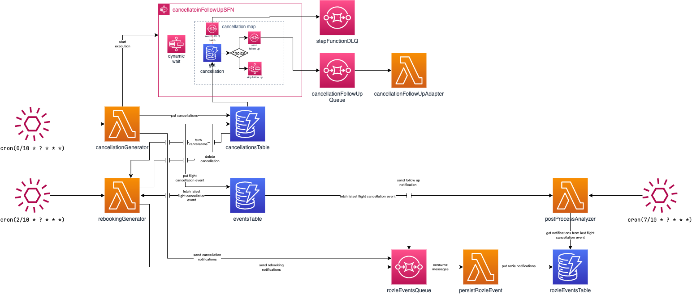

# Step Function Flink Substitution PoC
## 1. Introduction
The scope of this PoC is to illustrate how Step Functions can be used as a cheap and scalable solution to processing events in a delayed manner.
## 2. Infrastructure
The infrastructure will be shown in the following diagram.
